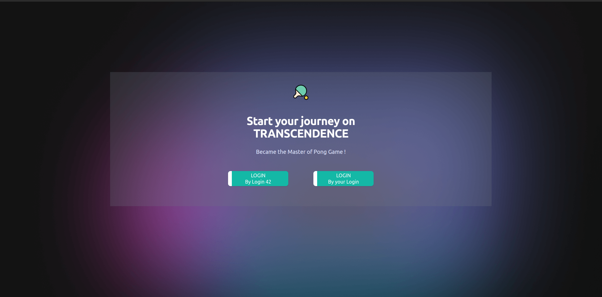
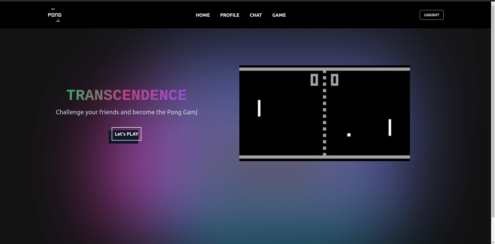
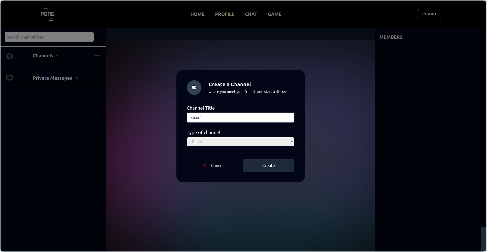
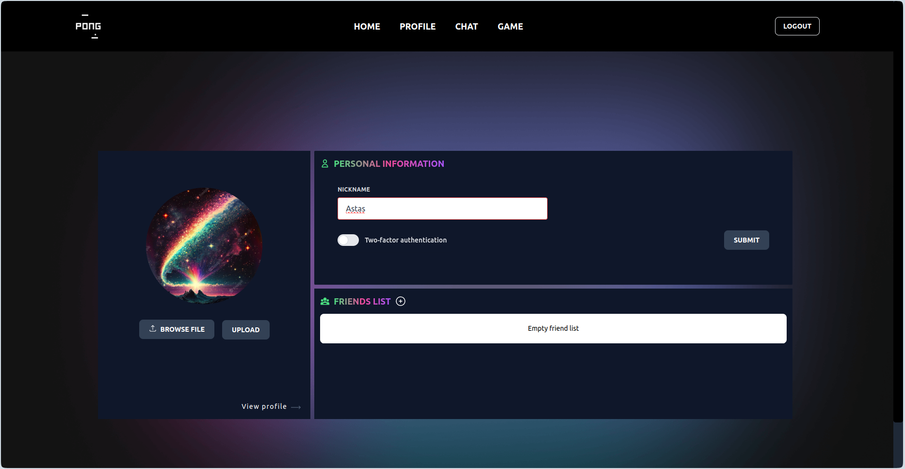
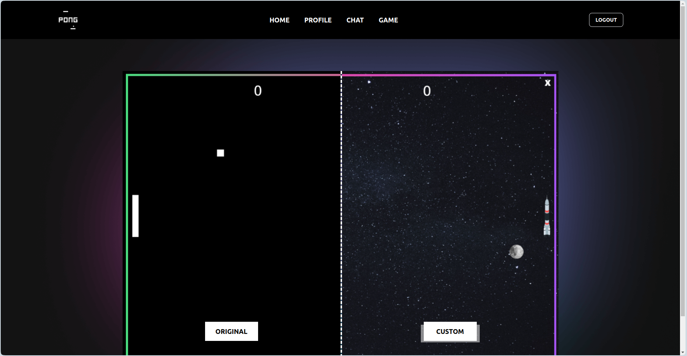
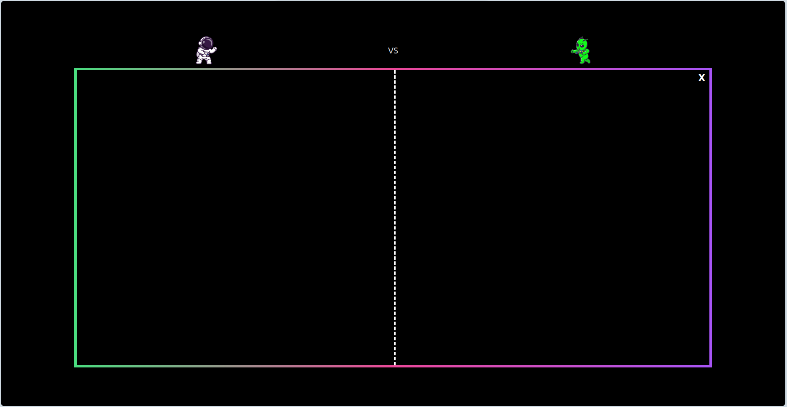

# Transcendence

create a website with an online pong game and a chat, all of this in a docker network using react for the front and nestjs for the back with postgresql database

## How to launch the program

1. Launch the website :

   ```sh
   $ make
   ```
then go to this URL on your navigator:

   ```sh
   $ http://localhost:3000
   ```

3. Remove all :

	```sh
	$ make fclean
	```

## Screenshots







